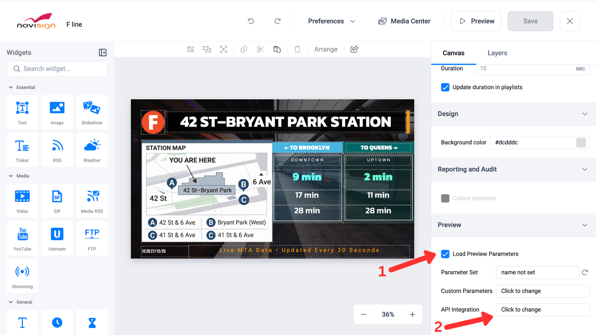

## Project Overview

**Name:** NoviSign API Sample Integration – Transportation (NYC MTA)

**Purpose:**  
This project demonstrates how to take data from any external source, process and normalize it, and push it into the NoviSign platform so it can be displayed on digital signage screens.

The repository includes a fully working end-to-end example using New York City MTA real-time transportation data.  
Developers can clone the project, run it locally, and immediately see live results before building their own custom integrations or production-ready solutions.

## What This Demo Does

This project simulates a real-world digital signage scenario near **Bryant Park, New York City**, focused on the **F subway line**.

Every 30 seconds, the service:
- Fetches real-time transportation data from the **NYC MTA GTFS-Realtime API**
- Filters arrivals for the **F Line** at the **42 St–Bryant Park** station
- Converts arrival times into a simple **minutes-away format**
- Pushes the processed data into **NoviSign Catalog Items**, making it available to digital signage creatives

This demo demonstrates a complete **end-to-end NoviSign API integration** — from consuming third-party data, through data processing and normalization, to real-time presentation on digital signage screens.

The data is pushed using the NoviSign Catalog API:


```
https://{STUDIO_DOMAIN}/catalog/items/{items-group}
```

---

## Demo Results

Below is an example NoviSign creative displaying **F Line arrivals in both directions (Uptown and Downtown)** from the **42 St–Bryant Park** station:

<div align="center">
  
</div>

## **Requirements**

- Node.js (LTS recommended): **18+ or 20+**  
  Download from https://nodejs.org/ or use `nvm` / `fnm`.

Check versions:

```bash
node -v
npm -v
```

## **Install project dependencies**

```bash
npm install
```

# **Main project files**

- **server.js** — Main backend:  
  `pushToNoviSign()`, `fetchFTrainArrivals()`, `formatDataForNoviSign()`, auto-update loop.
- **index.html** — Demo documentation page served at `/`.
- **F_line_station.nvc** - Novisign sample creative to drag and drop to your account.
- **Hotel_F_line.nvc** - Novisign sample creative to drag and drop to your account.

---

# **Usage**

## **Configure environment variables**

Create a file named `.env` in the project root:

```env
NOVISIGN_API_KEY=your_novisign_api_key
NOVISIGN_STUDIO_DOMAIN=app.novisign.com
PORT=3000
```

Where to get values:

- **NOVISIGN_API_KEY** → Request from NoviSign.  
- **NOVISIGN_STUDIO_DOMAIN** → Typically `app.novisign.com`.

## **Start the demo server**

```bash
npm start
# or:
node server.js
```

Then open:

```
http://localhost:3000
```

This will send every 30 seconds json data to novisign


### JSON Structure Sent to NoviSign

```json
{
  "queens_1":  { "minutesAway": "5 min"  },
  "queens_2":  { "minutesAway": "12 min" },
  "queens_3":  { "minutesAway": "18 min" },
  "brooklyn_1": { "minutesAway": "3 min" },
  "brooklyn_2": { "minutesAway": "8 min" },
  "brooklyn_3": { "minutesAway": "15 min" }
}
```

## NoviSign Studio – Using the Demo Creative (Recommended)

For this demo, you **do not need to build a new creative from scratch** or manually bind each data field.

A ready-made **NoviSign creative (.nvc)** are included in this repository and already contains the full layout and all required data fields.

### Step 1: Import the Demo Creative
1. Open **NoviSign Studio**
2. Drag and drop the provided `.nvc` file into the **Creatives** window
3. A new creative will appear, pre-configured with the full transportation layout

---

### Step 2: Fix the Missing Account Key (Expected Errors)
After importing the creative and opening it in **Edit mode**, you will notice **six error indicators**.

This is expected.

The errors appear because the creative was exported **without your personal NoviSign Account Key**.

You only need to fix this **once**.

<div align="center">
  
</div>

1. Go to: Load Preview Parameters
2. Click `Click to change`
3. Click Edit to `mta`
4. In the **API URL** field: `https://app.novisign.com/catalog/{YOUR-ACCOUNT-KEY}/items/mta-f-train`

Replace `{YOUR-ACCOUNT-KEY}` with your actual **NoviSign Account Key**.

5. Save the changes
See video below:

https://github.com/user-attachments/assets/77784072-6466-4e52-9ce6-1146a67ed7e6

## **How to Get Your NoviSign Account Key**

Go to **Profile Settings → Account Settings**.

Copy the value labeled **Account Key**.

<div align="center">
  
</div>

## **Go Live – Displaying Your Content on a Screen**

<details>
  <summary><b>Follow these steps to link your data to the screen and go live.</b></summary>

### 🖥️ Software Configuration (NoviSign Studio)
Before displaying content, you must set up your data connection and organize your media.

#### **Step 1: Create Screen Configuration**
This step tells the player exactly where to pull real-time data from.
* **Navigate:** Click your **account name** in the top right > **Advanced Settings** > **Configurations**.
* **Create:** Click the blue **+ New Configuration** button.
* **Identify:** Under **Config Name**, enter `mta-screen-configuration`.
* **Activate API Integration:** Scroll down to **API Integration**, check the box, and click **"Click to change"**.
* **Connect:** Click **Add** and enter these specific details:
    * **Name:** `mta`
    * **API URL:** `https://app.novisign.com/catalog/{YOUR-ACCOUNT-KEY}/items/mta-f-train`
    * **Property key:** `update`
    
    ⚠️ **Important:** Replace `{YOUR-ACCOUNT-KEY}` with your actual Account key!
* **Save:** Click **Save**, then **OK**, and finally click the blue **Update** button at the top.

See video of how to create Screen Configuration:

https://github.com/user-attachments/assets/88e55976-e41c-40d4-9d15-86262ff7e350

#### **Step 2: Organize Your Playlist**
A playlist determines which "Creatives" (your designs) will play and in what order.
* **Navigate:** Select **Playlists** from the top menu.
* **Edit/Create:** Click the **pencil icon** on an existing playlist (e.g., `Demo Playlist`) to modify it.
* **Add Content:** Drag your creative (e.g., `F line`) from the left **Select Creative** panel into the playlist timeline on the right.
* **Finalize:** Click the red **Update** button in the top right corner to save the sequence.

See video of how to Edit playlist:

https://github.com/user-attachments/assets/7fdd0722-5f4d-4590-ab1d-05e8a4aeee82

#### **Step 3: Link Configuration to Your Screen**
This step links your API configuration to the screen, ensuring that the player automatically retrieves and applies your custom data settings upon launch.
* **Navigate:** Click **Screens** in the top menu.
* **Configure:** Find your screen (e.g., `My First Screen`), click the **three dots (menu)** in the bottom right corner of the screen thumbnail, and select **Set Configuration**.
* **Select:** Choose the `mta-screen-configuration` you created earlier.
* **Confirm:** Click **OK**. Your screen is now "data-aware."

Video of how to link configuration:

https://github.com/user-attachments/assets/ef4db2e6-b4e5-4a6e-b848-f987b69035bf

---

### 📱 Hardware Implementation (Android Player)
Now that the cloud setup is complete, you need to launch the content on your physical device.

1.  **Download the App:** On your Android device (TV, Tablet, or Phone), open the Google Play Store and search for **"NoviSign Digital Signage"**.
2.  **Log In:** Launch the app and sign in using your NoviSign account credentials.
3.  **Select Screen:** Choose the screen you would like to view (e.g., select **"My First Screen"**).
4.  **Go Live:** Press **Play**. The player will download the `F line` creative and begin displaying the live data from the MTA API URL.

</details>

## Credits

Thanks to the **Metropolitan Transportation Authority (MTA)** for providing free access to public transit APIs.

